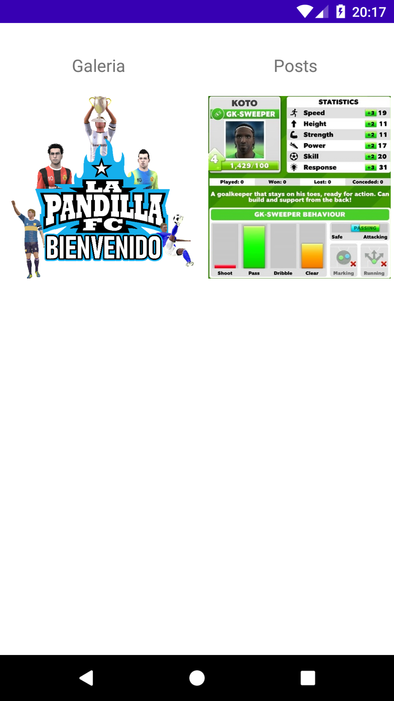
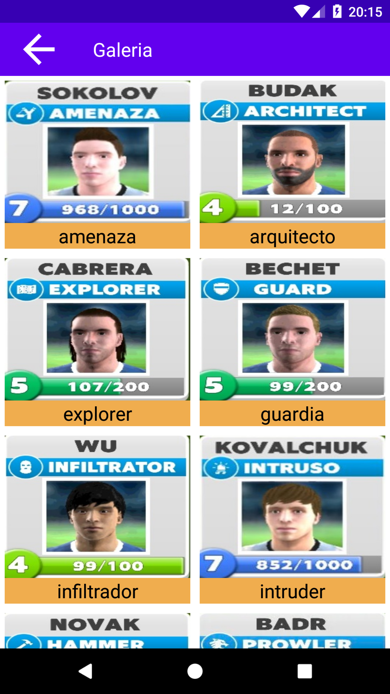
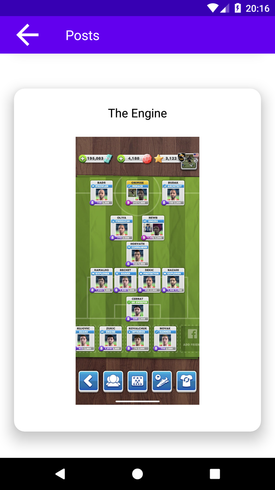
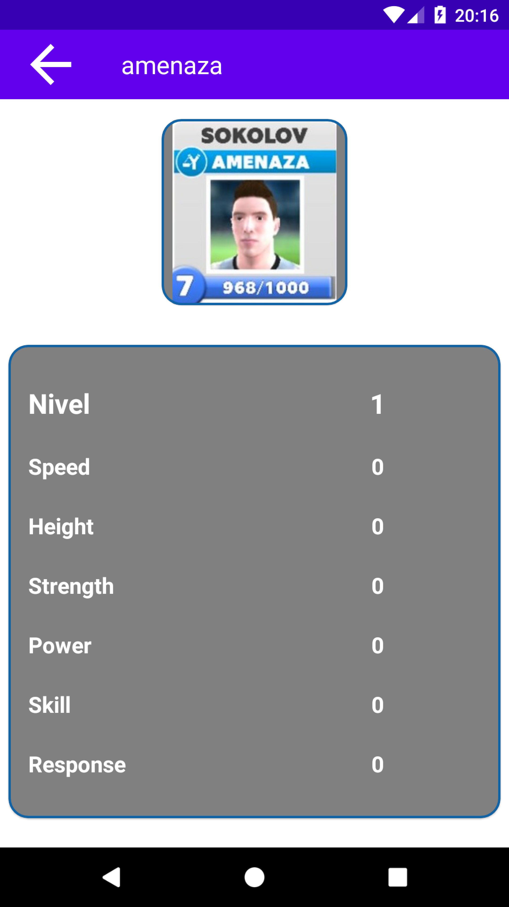
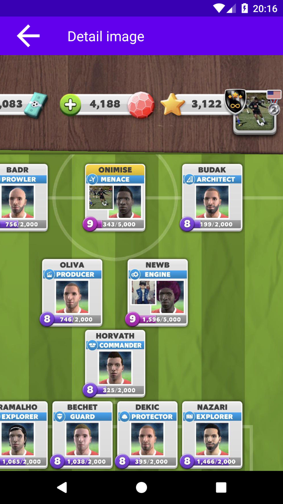

# ScoreMatch

#### En esta aplicacion android se usan las sigientes tecnologias 
- Retrofit
- Fragments 
- Picaso (para manejo de imagenes) 
- ReciclerView 
- MVVM(viewmodel,livedata)
- Navigation compoenent
- Kotlin  
- Shared Preferences  
- Control de versiones GIT 

## Video de demostracion https://www.youtube.com/watch?v=JbyBK6CXJlQ
 <table>
  <tr>
    <td><strong>Menu</strong></td>
   <td><strong>Galeria</strong></td>
    <td><strong>Post</strong></td>
  </tr>
  <tr>
    <td></td>
    <td></td>
    <td></td>
  </tr>
  
  
  <tr>
    <td><strong>Detail Player</strong></td>
   <td><strong>Detail image</strong></td>
    <td><strong>Post</strong></td>
  </tr>
  <tr>
    <td></td>
    <td></td>
  </tr>
  
  
</table>

